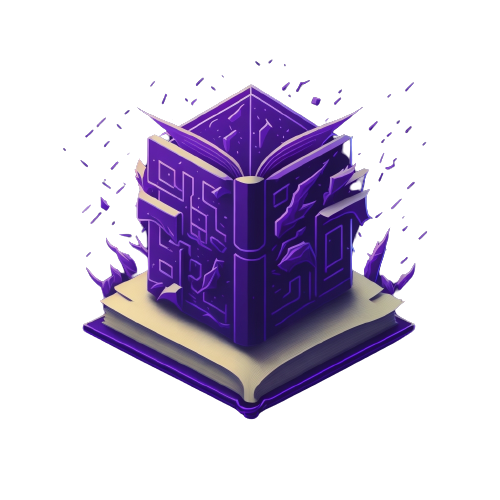

<br />
<div align="center">
  <a href="https://github.com/Hrishikesh332/RetroNexus">
    
  </a>

  <h3 align="center">RetroNexus</h3>

  <p align="center">
    LRetroNexus - AI and Blockchain Unite for an Unforgettable Gaming Experience 🎮
    <br />
    <a href="https://github.com/Hrishikesh332/RetroNexus"><strong>Explore the docs »</strong></a>
    <br />
    <br />
    <a href="https://github.com/Hrishikesh332/RetroNexus">View Demo</a>
    ·
    <a href="https://github.com/Hrishikesh332/RetroNexus/issues">Report Bug</a>
    ·
    <a href="https://github.com/Hrishikesh332/RetroNexus/issues">Request Feature</a>
  </p>
</div>


<details>
  <summary>Table of Contents</summary>
  <ol>
    <li><a href="#About">About</a></li>
    <li><a href="#Features">Features</a></li>
    <li><a href="#Tech-Stack">Tech Stack</a></li>
    <li><a href="#Languages-and-Tools">Languages and Tools</a></li>
    <li><a href="#Workflow">Workflow</a></li>
    <li><a href="#Instructions-on-running-project-locally">Instructions on running project locally</a></li>
    <li><a href="#Contributing">Contributing</a></li>
    <li><a href="#Guide">Guide</a></li>
    <li><a href="#License">License</a></li>

  </ol>
</details>

------

## About

RetroNexus is not just another game; it's a thrilling fusion of artificial intelligence and blockchain technology, designed to immerse players in a world of endless possibilities. Imagine a game that adapts and evolves with your every move, crafting a unique narrative that keeps you on the edge of your seat. That's exactly what RetroNexus delivers 📜🔄

Our AI-driven storytelling engine is at the heart of RetroNexus. It's not just about gameplay; it's about creating a narrative that responds dynamically to your decisions 🤖 As you embark on your journey through RetroNexus, the AI generates a story that twists and turns based on the actions you take. This sense of unpredictability adds a new layer of excitement to your gaming experience, making every playthrough a fresh and thrilling adventure 📖

RetroNexus also lets you earn while you play. As you conquer each level, you'll be rewarded with a unique digital asset – an NFT (Non-Fungible Token) representing your achievements in the game 💼 These NFTs aren't just virtual trophies; they're valuable assets that you can collect, trade, or even sell in the blockchain marketplace. It's a new way to recognize your gaming skills and turn them into something tangible 🌐

## Features

🌌 Dynamic AI-Generated Storytelling - Experience a narrative that adapts to your every move.

💎 NFT Rewards - Earn unique digital assets as you conquer levels.

🌠 Brace yourself for unexpected surprises at every turn.

🚀 Redefine your gaming journey with RetroNexus.


## Languages and Tools

<a href="https://huggingface.co/" target="_blank" rel="noreferrer">  </a><a href="https://www.python.org/" rel="noreferrer">  </a><a href="https://www.llamaindex.ai/" rel="noreferrer">  </a>


 
 ## Instructions on running project locally:

Clone the project

```bash
  git clone https://github.com/Hrishikesh332/RetroNexus.git
```

Install dependencies:

```bash
    cd www.retronexus.in
    npm install
```

Run Project on terminal

```bash
  npm run dev
```


## Contributing

Contributions are always welcome!

See `CONTRIBUTING.md` for ways to get started.

Please adhere to this project's `CODE_OF_CONDUCT.md`.

## Guide

A guideline of project composition and creation.

soon adding `guide.md`

Please adhere to this project's `CODE_OF_CONDUCT.md`.


## License

[](https://www.gnu.org/licenses/gpl-3.0)

